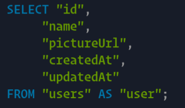

# sequelize-pretty-logger

A Logger for the Sequelize ORM that reindents and syntax highlights the SQL

This relies on `prismjs`, `prism-console` and `pretty-data` modules to work 
it's magic.

It changes the default hard to read sequelize logging from this:


To this:



## Usage

First install the package

`npm install sequelize-pretty-logger`

Then require it in and call it to initialize your log function.

Then feed it to sequelize's logging option.

```js
const log = require('sequelize-pretty-logger')();

const db = new Sequelize(process.env.DATABASE_URL, {
  logging: log
});
```
